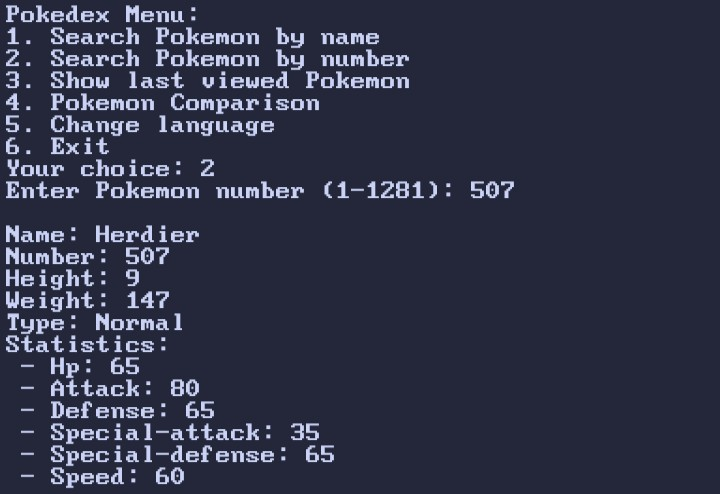

# Pokedex-CLI

<p align="center">
  <a name="top" href="#octocat-hi-there-thanks-for-visiting-">
    
    
    
    
    
  </a>
</p>

# Info

<p align="center">

 <a href="https://github.com/vizeeart">
    
  </a>
<a href="https://github.com/vizeeart/followers">
  </a>
<a href="https://github.com/vizeeart/Pokedex-CLI/stargazers/">
<a href="https://github.com/vizeeart">
  
</a>
<a href="https://github.com/vizeeart">
  
</a>
<a href="https://github.com/vizeeart">
  
</a>
<a href="https://github.com/vizeeart">
  
</a>
</div>
</p>

##
### :octocat: Hi, thanks for spending your time visiting this repository !
<p>
  This is the cli version of the pokedex
</p>

## Feature: 
1. Search by name 
2. Search by number 
3. Show last viewed pokemon 
4. Pokemon Comparison

# Installation Package
<details open>
<summary>Termux (Android) / Linux</summary>

- ```bash
  $ apt update && apt upgrade
  ```

- ```bash
  $ apt install ruby git -y
  ```

## Installation Project

- ```bash
  $ git clone https://github.com/vizeeart/Pokedex-CLI
  ```

- ```bash
  $ cd Pokedex-CLI
  ```

- ```bash
  $ ruby pokemon.rb
  ```
